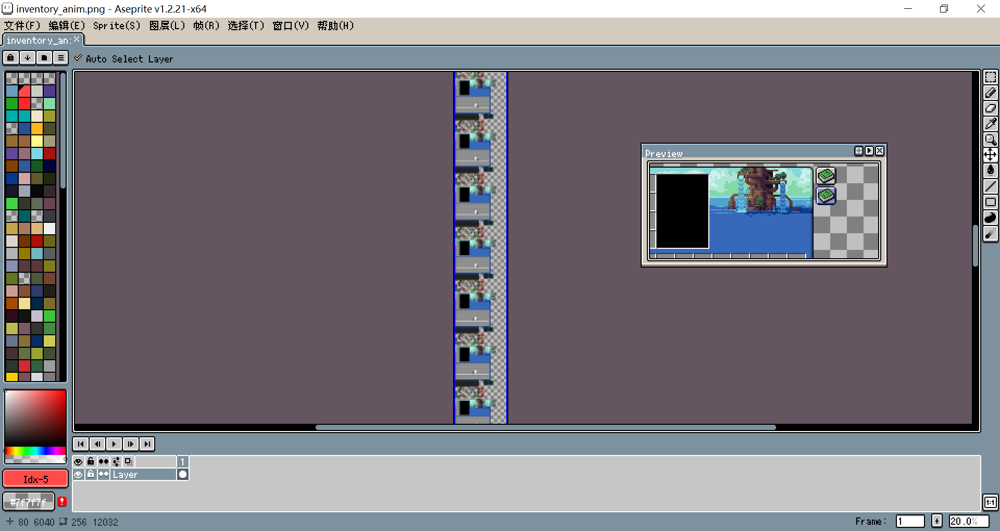
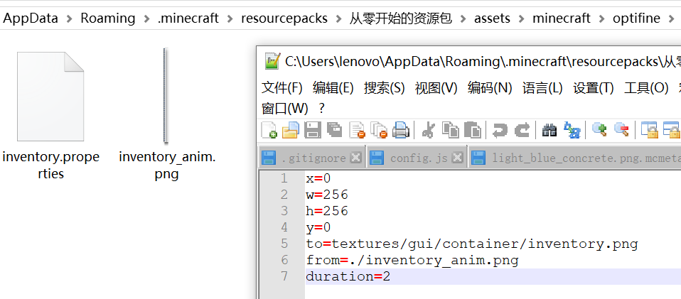
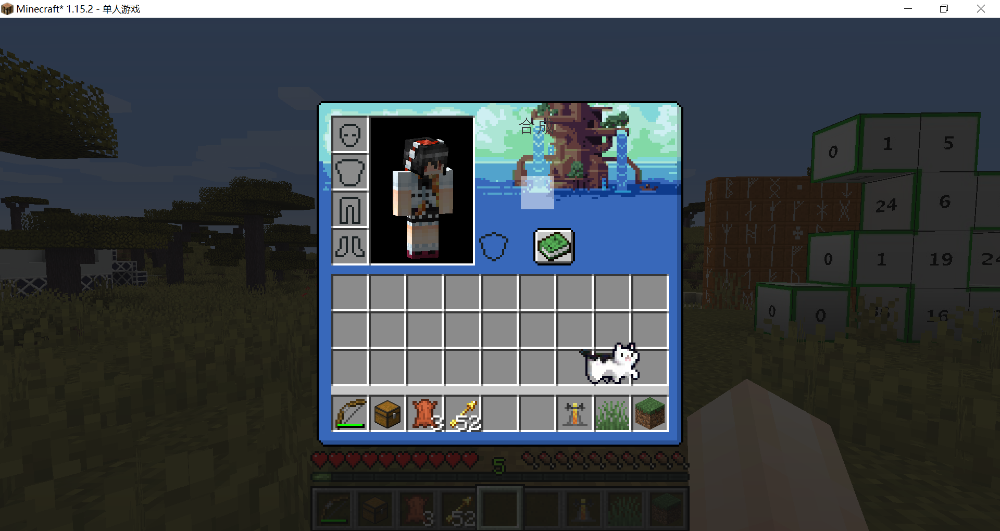
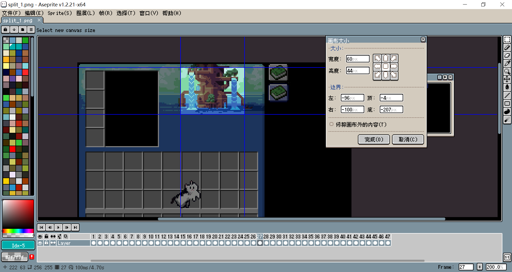
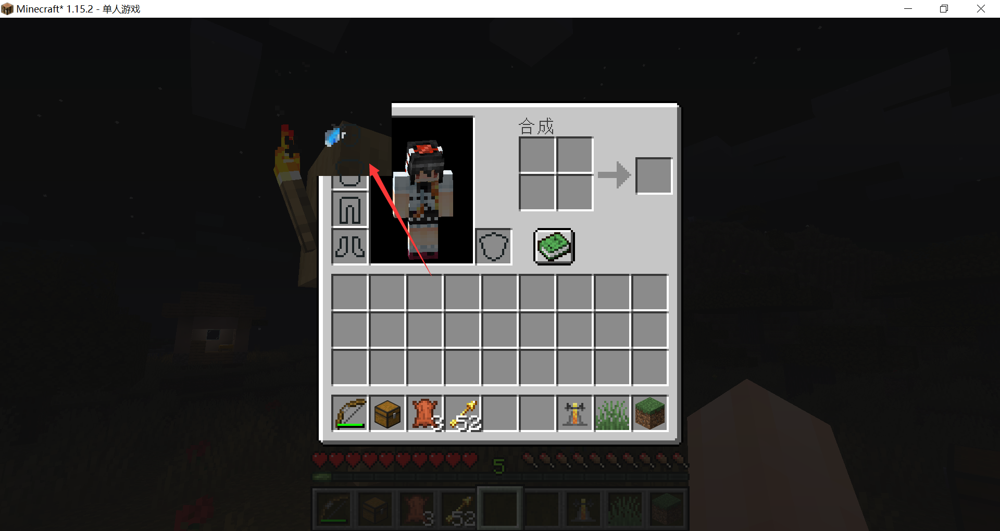

# 猫猫——生存模式物品栏

这次我们要实现如下效果：

::: bv 1WK411H7o4

:::

和一般的动态材质没多少区别，首先，都要逐帧制作动画，拼接成一个长条胶卷：



然后在optifine文件夹下新建一个名为anim的文件夹，将做好的材质放进去。

::: warning

1.13之前anim文件夹应该放在mcpatcher文件夹下。

:::

新建一个properties文件，为了方便辨识，我将其取名为inventory.properties:

**inventory.properties**

```properties
# form是动态材质的文件路径
from=./inventory_anim.png
# to是将动态材质用于哪张图片，我将这张图片称为目标材质。
# form和to连起来就是，将inventory_anim.png作为inventory.png的动态材质。
# 当游戏显示inventory.png时，其部分区域会变成inventory_anim.png的动态材质。
# 注意，只是部分区域，和普通的动态材质不同，optifine的动态材质不是将整张图片动态化，而是将某个区域动态化。
# 一张很大的图片，也可以动态化它的一个小区域。
to=textures/gui/container/inventory.png
# 动态化区域是目标材质的一个长方形区域，它的左上角称为动态化区域的原点，x和y是原点在目标材质中的坐标。
x=0
y=0
# w和h是动态化区域的长和宽。这个尺寸要和动态材质的一帧的尺寸吻合。
w=256
h=256
# duration是每帧的持续时长，相当于原版动态材质的frametime。
duration=2
```

如果对图片的坐标不太理解，我简单解释一下，png图片最左上方的点坐标为(0,0)，如果图片的尺寸是16×16，那最右下方的点的坐标为(15,15)。



::: warning

一件非常怪异的事是，似乎必须把目标材质放在材质包内，optifine才会识别出目标材质。


上图说的“长啥样并不影响结果”并不准确，它的分辨率必须得和属性文件里的保持一致。

我猜测这样做是为了防止单打独斗的动态材质覆盖到分辨率和画风完全不同的材质包上而出现非常离谱的画面，于是强制材质包作者放上一张材质。但这个问题是我测试得出的结论，文档里并没有写。

:::

进入游戏看看效果，效果是很好的：



现在就有一个问题，既然这张材质的动态化区域实际上只有右上方的流水和右下角的猫猫，那么我们就可以压缩一下动态材质占用的空间。用某一帧覆盖掉原先的GUI，然后用两个属性文件分别将两段小的动态材质贴到GUI上。

在aseprite里，分割动态材质的某个区域的方式是调整画布大小，将画布外的给剔除掉，得到的就是裁切后的动态材质了，然后导出动画的每一帧，拼接成一张小的长条形图片。

由于比较枯燥，我就不详细演示了。

还有一个测试出来的情报就是，动态材质不是覆盖在动态区域上，而是直接将动态区域给替换了：



<br/><br/><Vssue/>