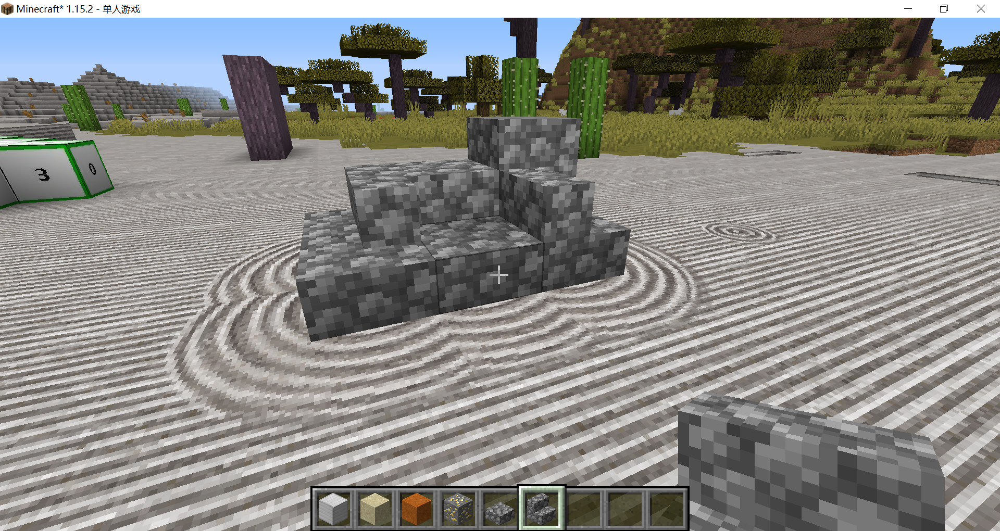

# 枯山水——随机材质

接下来我们要实现枯山水的另一种方块：


我们希望沙子的材质随机显示这四张材质中的一张，这一点用blockstates的随机模型很容易实现，但这里要介绍另一种连接材质方法：随机材质

**karesansui2.properties**

```properties
matchBlocks=minecraft:sand
# method要填random
method=random
# 随机材质方法可以用任意多张材质，我们用四张，分别名为1,2,3,4，所以可以写1-4
# 但实际上1-4只是一种简写，下面几种写法都是可行的：
# tiles = 1 2 3 4
# tiles = 1-2 3.png 4
# 前面的写法都要求图片和属性文件在同一个路径下，但实际上属性文件还可以引用不在同一个路径下的图片
# tiles = optifine/ctm/karesansui/2/1.png 2 3 4
tiles=1-4
# 此外，我们还可以设置每张材质出现的权重，例如我想让这四张材质出现的概率之比为3:2:1:1，可以写：
# weights=3 2 1 1
# 不过在这个例子中没有设置权重的必要，就不设置了
```

::: tip 提示

图片路径的详细说明请看[OptiFine帮助文档](https://www.mcbbs.net/forum.php?mod=redirect&goto=findpost&ptid=896135&pid=15601221)

:::

同时把沙子的随机旋转取消掉：

**sand.json**

```json
{
    "variants": {
        "": [
            { "model": "block/sand" }
        ]
    }
}
```

保存，重载材质包，查看一下效果吧。



<br/><br/><Vssue/>